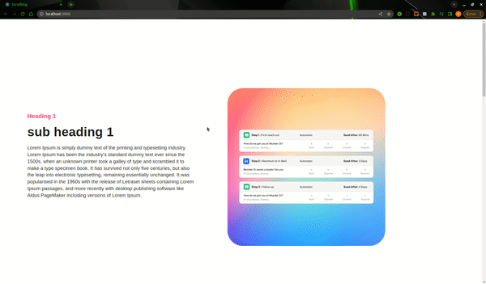

## Preview url : https://main--sprightly-madeleine-ce0acb.netlify.app/

## Techstack Used : ReactsJS , Material UI.

## Preview



## Components

- Contents : Fetches Data from the given API.
- Text : Formats the Data .
- Video : Contains Video Links to be displayed.
- Player : Loads the videos.

## Installations

Install the dependencies and devDependencies and start the server.

```sh
cd scrolling
npm i
npm start

```
